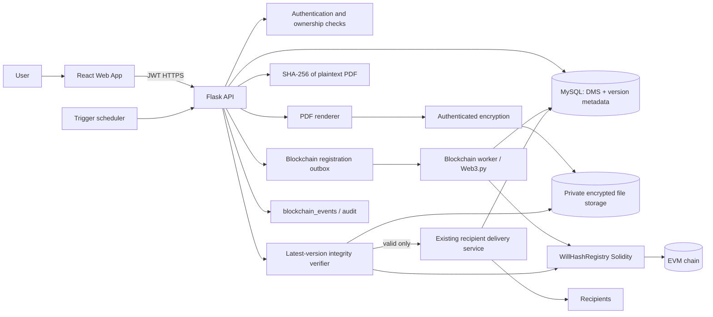
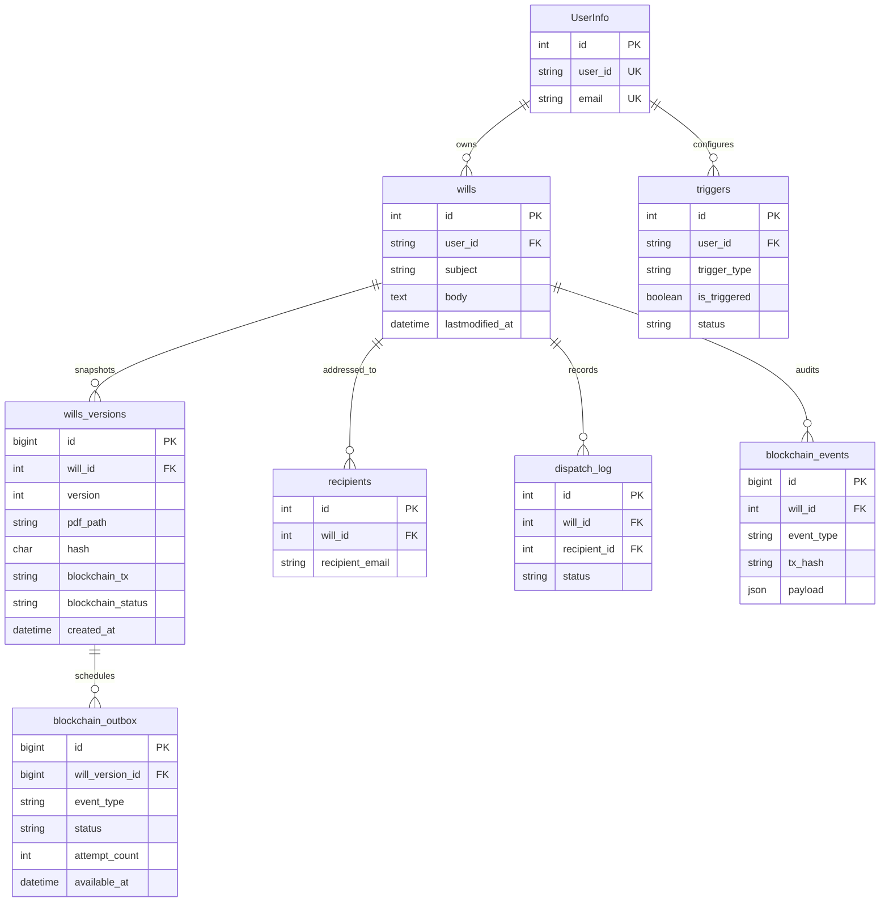

# Blockchain-backed Will Integrity Architecture

> DMS (`willtesta`) implementation specification. This document defines an incremental design that preserves the existing MySQL `wills`, `recipients`, `triggers`, and `dispatch_log` tables and Flask `/api/...` route conventions.

## 1. Scope and design decisions

- `wills` remains the editable, current draft. A confirmed snapshot is immutable and stored in `wills_versions`; edits to a confirmed will create a new version only after confirmation.
- Generate the PDF on the server from a stable snapshot of `subject`, `body`, and relevant metadata. Hash the exact plaintext PDF bytes with SHA-256 before encryption. This enables a recipient-provided PDF to be verified without needing the encryption key.
- Encrypt PDF bytes at rest with authenticated encryption (AES-256-GCM). Keep keys in a secrets manager/KMS, not in MySQL, source control, the container image, or alongside the encrypted PDF. Store a key identifier and nonce with the version metadata so keys can be rotated.
- Never put will contents, recipient addresses, PDF bytes, or personally identifying details on a public chain. The chain stores only opaque will ID, version, content hash, user ID reference, and timestamp. Prefer a permissioned chain or a privacy-reviewed chain deployment; a hash is still linkable metadata.
- The database and blockchain cannot share an ACID transaction. Treat registration as an asynchronous state machine, persist a pending record/outbox first, and retry idempotently. Do not report a confirmed blockchain registration until the transaction has the configured confirmation depth.
- The API paths in this design are prefixed with `/api`, matching the current Flask application. Existing `POST /api/wills` and `PUT /api/wills/{will_id}` remain compatible; the new explicit confirm/update operations are additive.

## 2. System architecture



**Trust boundary:** the API authenticates the caller and checks will ownership before reads or writes. The worker uses a dedicated registrar wallet with narrowly scoped credentials. Private keys are supplied through a KMS/HSM or secret manager and are never returned by the API.

## 3. Solidity smart contract

Illustrative Solidity 0.8.x contract. `registrar` is the backend's authorized transaction signer. `registerWillHash` is immutable per `(willId, version)`: retries of an identical registration are idempotent, while conflicting hashes revert. Production deployment must pin compiler/dependency versions, verify the deployed bytecode, and configure registrar rotation and monitoring.

```solidity
// SPDX-License-Identifier: MIT
pragma solidity ^0.8.24;

contract WillHashRegistry {
    address public owner;
    address public registrar;

    struct VersionRecord {
        bytes32 hash;
        string userId;
        uint64 timestamp;
        bool exists;
    }

    mapping(uint256 => mapping(uint256 => VersionRecord)) private versions;
    mapping(uint256 => uint256) private versionCounts;

    event WillHashRegistered(
        uint256 indexed willId,
        uint256 indexed version,
        bytes32 hash,
        string userId,
        uint64 timestamp
    );
    event RegistrarChanged(address indexed oldRegistrar, address indexed newRegistrar);
    event OwnershipTransferred(address indexed oldOwner, address indexed newOwner);

    error Unauthorized();
    error InvalidInput();
    error VersionConflict();
    error VersionNotFound();

    constructor(address initialRegistrar) {
        if (initialRegistrar == address(0)) revert InvalidInput();
        owner = msg.sender;
        registrar = initialRegistrar;
    }

    modifier onlyOwner() {
        if (msg.sender != owner) revert Unauthorized();
        _;
    }

    modifier onlyRegistrar() {
        if (msg.sender != registrar) revert Unauthorized();
        _;
    }

    function registerWillHash(
        uint256 willId,
        uint256 version,
        bytes32 hash,
        string calldata userId
    ) external onlyRegistrar {
        if (willId == 0 || version == 0 || hash == bytes32(0) || bytes(userId).length == 0) {
            revert InvalidInput();
        }

        VersionRecord storage record = versions[willId][version];
        if (record.exists) {
            if (record.hash == hash && keccak256(bytes(record.userId)) == keccak256(bytes(userId))) {
                return;
            }
            revert VersionConflict();
        }

        // Require sequential versions so latest/version-count have one unambiguous meaning.
        if (version != versionCounts[willId] + 1) revert InvalidInput();

        uint64 registeredAt = uint64(block.timestamp);
        versions[willId][version] = VersionRecord(hash, userId, registeredAt, true);
        versionCounts[willId] = version;
        emit WillHashRegistered(willId, version, hash, userId, registeredAt);
    }

    function getLatestHash(uint256 willId)
        external view returns (uint256 version, bytes32 hash, uint64 timestamp, string memory userId)
    {
        version = versionCounts[willId];
        if (version == 0) revert VersionNotFound();
        VersionRecord storage record = versions[willId][version];
        return (version, record.hash, record.timestamp, record.userId);
    }

    function getHashByVersion(uint256 willId, uint256 version)
        external view returns (bytes32 hash, uint64 timestamp, string memory userId)
    {
        VersionRecord storage record = versions[willId][version];
        if (!record.exists) revert VersionNotFound();
        return (record.hash, record.timestamp, record.userId);
    }

    function getVersionCount(uint256 willId) external view returns (uint256) {
        return versionCounts[willId];
    }

    function setRegistrar(address newRegistrar) external onlyOwner {
        if (newRegistrar == address(0)) revert InvalidInput();
        emit RegistrarChanged(registrar, newRegistrar);
        registrar = newRegistrar;
    }

    function transferOwnership(address newOwner) external onlyOwner {
        if (newOwner == address(0)) revert InvalidInput();
        emit OwnershipTransferred(owner, newOwner);
        owner = newOwner;
    }
}
```

### Contract/API representation

- Encode the 32-byte SHA-256 digest as Solidity `bytes32` (`0x` + 64 lowercase hex characters). Do not hash a hex string or encrypted ciphertext.
- The DB `will_id` is an integer and maps to `uint256`. `user_id` is the existing opaque `UserInfo.user_id`; it is not an email.
- `getLatestHash` returns the version along with its hash and metadata. The caller must compare this returned version with the DB's latest registered version to detect a stale or incomplete DB state.
- Blockchain timestamps are block timestamps, not trusted wall-clock timestamps. Keep `created_at` in MySQL separately and record the observed block timestamp in the event payload when the receipt is indexed.

## 4. Database extension

The following MySQL DDL is additive. `wills_versions` stores immutable PDF snapshots, `blockchain_outbox` stores retryable registration jobs, and `blockchain_events` is the audit history. Insert the version and outbox job in the same MySQL transaction. `pdf_path` identifies an encrypted private object; never expose it as a public URL.

```sql
CREATE TABLE IF NOT EXISTS wills_versions (
    id BIGINT NOT NULL AUTO_INCREMENT,
  will_id INT NOT NULL,
  version INT NOT NULL,
  pdf_path VARCHAR(1024) NOT NULL,
  hash CHAR(64) CHARACTER SET ascii COLLATE ascii_bin NOT NULL,
  blockchain_tx VARCHAR(66) NULL,
  blockchain_status ENUM('pending', 'submitted', 'confirmed', 'failed') NOT NULL DEFAULT 'pending',
  blockchain_block BIGINT NULL,
  encryption_key_id VARCHAR(255) NOT NULL,
  encryption_nonce VARBINARY(12) NOT NULL,
  created_at DATETIME NOT NULL DEFAULT CURRENT_TIMESTAMP,
  confirmed_at DATETIME NULL,
  PRIMARY KEY (id),
  UNIQUE KEY uq_wills_versions_will_version (will_id, version),
  INDEX idx_wills_versions_latest (will_id, version),
    INDEX idx_wills_versions_hash (hash),
  CONSTRAINT fk_wills_versions_will FOREIGN KEY (will_id) REFERENCES wills(id)
);

CREATE TABLE IF NOT EXISTS blockchain_events (
    id BIGINT NOT NULL AUTO_INCREMENT PRIMARY KEY,
  will_id INT NOT NULL,
  event_type VARCHAR(64) NOT NULL,
  tx_hash VARCHAR(66) NULL,
  payload JSON NOT NULL,
  created_at DATETIME NOT NULL DEFAULT CURRENT_TIMESTAMP,
  INDEX idx_blockchain_events_will_created (will_id, created_at),
  INDEX idx_blockchain_events_tx (tx_hash),
  CONSTRAINT fk_blockchain_events_will FOREIGN KEY (will_id) REFERENCES wills(id)
);

CREATE TABLE IF NOT EXISTS blockchain_outbox (
    id BIGINT NOT NULL AUTO_INCREMENT PRIMARY KEY,
    will_version_id BIGINT NOT NULL,
    event_type VARCHAR(64) NOT NULL,
    payload JSON NOT NULL,
    status ENUM('pending', 'processing', 'completed', 'failed') NOT NULL DEFAULT 'pending',
    attempt_count INT NOT NULL DEFAULT 0,
    available_at DATETIME NOT NULL DEFAULT CURRENT_TIMESTAMP,
    locked_at DATETIME NULL,
    locked_by VARCHAR(128) NULL,
    last_error TEXT NULL,
    created_at DATETIME NOT NULL DEFAULT CURRENT_TIMESTAMP,
    updated_at DATETIME NOT NULL DEFAULT CURRENT_TIMESTAMP ON UPDATE CURRENT_TIMESTAMP,
    completed_at DATETIME NULL,
    UNIQUE KEY uq_blockchain_outbox_version_event (will_version_id, event_type),
    INDEX idx_blockchain_outbox_ready (status, available_at),
    CONSTRAINT fk_blockchain_outbox_version FOREIGN KEY (will_version_id) REFERENCES wills_versions(id)
);
```

`wills_versions`' core requested columns (`will_id`, `version`, `pdf_path`, `hash`, `blockchain_tx`, `created_at`) are retained; status, block, and encryption metadata are additional operational fields. Outbox workers claim ready `pending` rows, set a lease (`processing`, `locked_at`, `locked_by`), and either mark them `completed`, schedule a retry by updating `available_at`, or mark permanent failures `failed`. The unique `(will_version_id, event_type)` key prevents duplicate registration jobs. `blockchain_events.payload` is audit-only and should contain safe metadata, for example `{ "version": 2, "hash": "...", "user_id": "...", "block_number": 123, "block_timestamp": 1700000000, "status": "confirmed" }`.

### ERD



The existing `dispatch_log` schema does not currently declare a foreign key for `recipient_id`; adding one is optional and should be a separate migration after checking existing data. Consider adding `will_version_id` to `dispatch_log` in a later migration so each delivery is provably tied to the exact immutable version sent.

## 5. Backend API design (Flask/Python)

All endpoints require HTTPS and an authenticated session/JWT. Enforce that the authenticated principal owns the requested `will_id`; never trust a caller-supplied `user_id` as authorization. Use request IDs and structured logs, but do not log will body, PDF bytes, encryption keys, or recipient PII.

| Operation | Endpoint | Purpose |
|---|---|---|
| Create draft | `POST /api/wills` (existing; equivalent to requested `/wills/create`) | Create editable `wills` record and optional recipients. Returns `will_id`, `status: draft`. |
| Confirm | `POST /api/wills/{will_id}/confirm` | Snapshot current draft, render and encrypt PDF, compute SHA-256, create version row/outbox job, then register the hash. |
| Update | `PUT /api/wills/{will_id}` (existing draft update) and `POST /api/wills/{will_id}/versions` | Edit draft; explicit version endpoint confirms a new immutable version from the updated content. Never overwrite an existing confirmed PDF. |
| List versions | `GET /api/wills/{will_id}/versions` | Return ordered versions and chain registration state, not storage paths or PDF contents. |
| Verify | `POST /api/wills/{will_id}/versions/{version}/verify` | Accept a PDF upload (`multipart/form-data`, field `file`) or verify the stored version when no file is supplied. Recompute SHA-256 and compare with on-chain hash. |
| Verify alias | `GET /api/wills/verify/{will_id}/{version}` | Requested route form for stored-version verification; return the same verification response. Do not accept PDF bytes in a GET request. |
| Check liveness | `POST /api/triggers/check` | Evaluate due/pending triggers and update `last_checked`; it does not itself send a will. Idempotent per trigger evaluation window. |
| Execute trigger | `POST /api/triggers/{trigger_id}/execute` | Recheck trigger eligibility, verify latest version against chain, then enqueue delivery to recipients only if valid. |
| Execute alias | `POST /api/trigger/execute` | Requested singular route form; body includes `trigger_id`. Prefer the existing plural `/api/triggers` namespace for implementation. |

### Confirm request/response

Request:

```json
{
  "idempotency_key": "client-generated-uuid"
}
```

Response after chain finality:

```json
{
  "success": true,
  "will_id": 42,
  "version": 1,
  "hash": "64-lowercase-hex-characters",
  "blockchain": {
    "status": "confirmed",
    "tx_hash": "0x...",
    "block_number": 123456
  },
  "created_at": "2026-09-27T12:00:00Z"
}
```

If registration is asynchronous, return `202 Accepted` with `blockchain.status: "pending"` and a version/status resource. A retry with the same idempotency key must not create another version or send another registration. A conflicting retry must return `409`.

### Verification response

```json
{
  "success": true,
  "will_id": 42,
  "version": 1,
  "valid": true,
  "computed_hash": "64-lowercase-hex-characters",
  "registered_hash": "64-lowercase-hex-characters",
  "blockchain_tx": "0x...",
  "block_number": 123456,
  "reason": null
}
```

For invalid content, return `200` with `valid: false` and a reason such as `hash_mismatch`; reserve 4xx/5xx for malformed requests, missing resources, unavailable chain, or internal failures. Never return a hash comparison as `valid: true` if the chain could not be queried. Return `503` for unavailable chain/RPC and keep the response indeterminate rather than treating an outage as tampering.

### Python module boundaries

- `routes/will_routes.py`: validate input, authenticate/authorize, call services, format responses.
- `services/will_pdf_service.py`: deterministic snapshot-to-PDF rendering and PDF validation.
- `services/will_storage_service.py`: AES-GCM encrypt/decrypt and private object storage operations; KMS integration.
- `services/will_integrity_service.py`: SHA-256, on-chain lookup, comparison, finality policy.
- `services/blockchain_service.py`: Web3.py contract calls, signing, receipt polling, retry/error classification.
- `services/will_version_service.py`: DB transaction, version allocation, outbox, lifecycle transitions.
- `services/trigger_dispatch_service.py`: liveness eligibility, verify-before-send gate, idempotent dispatch.

Dependencies: `web3.py`, `reportlab` or another maintained PDF generator (PyPDF2 is primarily for reading/manipulating existing PDFs, not ideal for document rendering), Python `hashlib`, and `cryptography`. Pin and review dependencies. Use SQLAlchemy migrations (Alembic/Flask-Migrate if already established) rather than editing production tables manually.

## 6. Confirm/update and blockchain registration flow

1. Lock the `wills` row for the owner and take a consistent snapshot of the draft fields. Determine the next version as `MAX(version) + 1` under a DB transaction and unique constraint.
2. Render the PDF from the snapshot. Validate that the output is non-empty and parseable. The PDF should include will ID, version, confirmation time, and a human-readable verification reference, but not claim that blockchain registration is final before it is.
3. Compute `sha256(pdf_bytes).hexdigest()` over the exact generated plaintext bytes. Encrypt those bytes using AES-256-GCM with a fresh 96-bit nonce and authenticated metadata (`will_id`, `version`, schema/key version). Store ciphertext in private object storage and retain the KMS key ID and nonce.
4. In one DB transaction, insert `wills_versions` with `blockchain_status='pending'` and a `blockchain_outbox` job with `status='pending'`. Commit before submitting a chain transaction. A failed DB commit must not submit an on-chain transaction.
5. An outbox worker claims a ready job and submits `registerWillHash(will_id, version, bytes32(hash), user_id)` using the registrar key. Save the tx hash and mark the version `submitted`; wait for configured confirmations and verify the receipt/event and contract readback.
6. On success, mark the outbox job `completed`, the version `confirmed`, and record block metadata plus a `WillHashRegistered` audit event. Only now return a final confirmed response and permit trigger delivery. Transient RPC/chain failures increment `attempt_count` and reschedule `available_at` with bounded exponential backoff; contract idempotency makes replay of an identical tuple safe.
7. On permanent failure, mark `failed`, retain an audit event, alert operators, and leave the prior confirmed version as the effective latest deliverable version. Do not dispatch the pending version.
8. On update, keep earlier versions and encrypted objects immutable. Editing `wills.body` changes only the draft/current content; a new version is created only after explicit confirmation. Protect version allocation from concurrent confirms with a row lock plus unique constraint.

## 7. Trigger and blockchain verification integration

```mermaid
sequenceDiagram
    participant S as Scheduler
    participant API as Flask trigger service
    participant DB as MySQL
    participant I as Integrity service
    participant FS as Encrypted storage
    participant BC as Smart contract
    participant D as Delivery service

    S->>API: check / execute due trigger
    API->>DB: lock trigger; check status and liveness criteria
    API->>DB: load latest confirmed will version and recipients
    API->>FS: load encrypted object and decrypt
    FS-->>API: plaintext PDF bytes
    API->>I: SHA-256(PDF bytes)
    I->>BC: getLatestHash(willId)
    BC-->>I: version, hash, timestamp, userId
    I->>I: compare hash and version with DB snapshot
    alt valid and versions agree and trigger is eligible
        I-->>API: valid
        API->>D: enqueue delivery with will/version idempotency key
        D->>DB: write dispatch_log pending/sent/failed
        D-->>API: delivery result
        API->>DB: mark trigger completed only per policy
    else mismatch, missing record, pending version, or chain unavailable
        I-->>API: invalid/indeterminate + reason
        API->>DB: write failed/blocked dispatch_log and audit event
        API->>DB: keep trigger retryable or escalate per policy
    end
```

Required checks before delivery:

- Select the highest `wills_versions.version` whose `blockchain_status='confirmed'`. Compare that version number to the contract's `getLatestHash` version. If the chain has a later version unknown to the DB, or the DB has a later unconfirmed version, stop and alert; do not silently fall back to stale content.
- Decrypt the private PDF. Authentication-tag failure is an integrity/security failure. Recompute SHA-256 over plaintext PDF bytes and compare the digest byte-for-byte with the chain's `bytes32` hash. Also compare the DB hash against the chain hash to detect DB corruption.
- Only a successful comparison authorizes delivery. Chain/RPC outage is `indeterminate`, never a successful verification; no recipient delivery occurs until a retry succeeds or an operator follows an explicit recovery procedure.
- Log a `dispatch_log` record per recipient with `status='failed'` on integrity failure, and record an audit reason (`hash_mismatch`, `version_mismatch`, `decrypt_failed`, `chain_unavailable`, or `no_confirmed_version`). Do not include PDF contents, recipient email, or cryptographic secrets in the audit payload.
- Make trigger execution and delivery idempotent. Add a unique dispatch idempotency key (recommended: `(trigger_id, will_version_id, recipient_id)` in a migration) so scheduler retries cannot email recipients twice. Add `will_version_id` to each dispatch record to show exactly which PDF was sent.
- Distinguish integrity failure from transient service failure in trigger state: integrity failure should be blocked and alert; RPC/storage/network errors should remain retryable with backoff. Never mark a trigger completed merely because execution was attempted.

## 8. React UI flow

1. **Will editor:** edit title/body and recipients using existing application forms; save as a draft through the existing API.
2. **Confirm action:** show a final confirmation dialog that clearly states a PDF snapshot will be created and its fingerprint registered. Disable duplicate submission while pending and send an idempotency key.
3. **Registration status:** show `PDF 생성 중`, `블록체인 등록 대기`, `등록 완료`, or `실패` based on server status. A transaction hash can link to a configured explorer only if the deployment is public and that exposure is acceptable.
4. **Version history:** list version, confirmation time, short hash/fingerprint, and chain status. Never display or link to an unauthenticated storage path. Older versions remain read-only.
5. **Version verification:** per-version action uploads a selected PDF or verifies the stored copy. Present verified, mismatch, or unable-to-check distinctly; a chain outage must not look like a mismatch or success.
6. **Trigger settings:** manage liveness interval/method, reminders, timezone, and status. Provide a clear pending/blocked state if no confirmed version is available.
7. **Recipients:** add/edit/remove recipient details under existing ownership controls and show delivery history tied to a specific will version.

Frontend calls use authenticated API clients and render server-owned state; no wallet private key, encryption key, contract signer, or PDF decryption key belongs in React. The backend controls all contract writes.

## 9. Incremental implementation order

1. Add and test the additive MySQL migration and SQLAlchemy models for versions/events/outbox lifecycle. This repository does not currently use Alembic; apply the versioned SQL migration to existing databases and keep the bootstrap SQL files synchronized for new databases.
2. Implement encrypted private PDF storage and deterministic rendering; add tests for encrypt/decrypt, tampering, and hash stability.
3. Deploy the contract to a local test chain, add Web3.py integration and contract tests for authorization, immutable versions, idempotent retry, and event contents.
4. Implement confirm/version APIs with pending/confirmed state and chain outage behavior.
5. Implement stored/uploaded PDF verification and response contracts.
6. Integrate trigger execution with verify-before-dispatch, per-recipient idempotency, dispatch logging, and retry/alert policy.
7. Add React version history, confirmation status, verification, trigger, and recipient workflows.
8. Run migration/rollback rehearsals, key-rotation drills, chain/RPC outage tests, and an end-to-end test proving a modified PDF is blocked from delivery.

## 10. Operational and security checklist

- TLS for API/RPC; private storage with least-privilege access and backups; encryption keys held outside the database and rotated with retained decrypt capability for historical versions.
- Restrict PDF size/type, validate uploads, generate server-side filenames, prevent path traversal, and clean temporary plaintext files.
- Use a dedicated funded registrar wallet, transaction nonce management, gas limits, secret rotation, RPC allowlisting, and transaction monitoring. Avoid signing transactions inside request workers if a background worker is available.
- Define chain ID, contract address, ABI version, confirmation depth, timeout, reorg handling, retry ceiling, and incident procedure in deployment configuration.
- Avoid storing personal data on public chains. Consider privacy/legal review, retention/deletion policy, and the fact that on-chain hashes and events are permanent and cannot be erased.
- Test DB/object-store/chain partial failures and chain reorganizations. Alert on stuck pending versions, failed registrations, unknown contract versions, verification failures, and trigger dispatch blocks.
